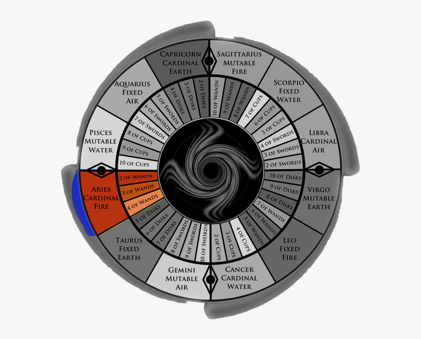

# House I: Identity

The first house, ruled by Aries, is the only house that is 100% about you you you. This is the house containing your rising sign, starting on the eastern horizon, where the sky meets the Earth.

The first house describes what is in your mind and body: your appearance, personality, and the filter you wear to see reality. How do you articulate who you are?

In the Simulation theory, which is one of the main subjects of this channel, we believe that your rising sign (aka, the sign in your first house) is the avatar you came in and the team you are playing for. So, for example, if I am Aquarius rising, I not only play for Aquarius, but I also see each of the 11th houses under the lenses of Aquarius.

### Topics of this house

* Self, the body, appearances
* First impressions
* Attitude, identity
* Approach to life

