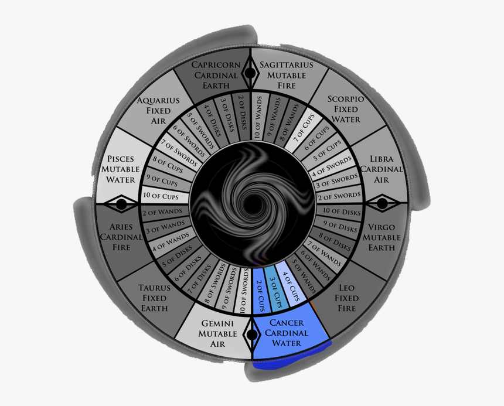

# House IV: Home and Family

The fourth house, ruled by Cancer, is associated with family, ancestry, traditions, the home you come from and the home you make for yourself.

### Topics of this house

* Ancestry, heritage, roots
* Foundations and environment
* Mother or caretaker
* Housing, household, real state
* Comfort, security, nurturing

