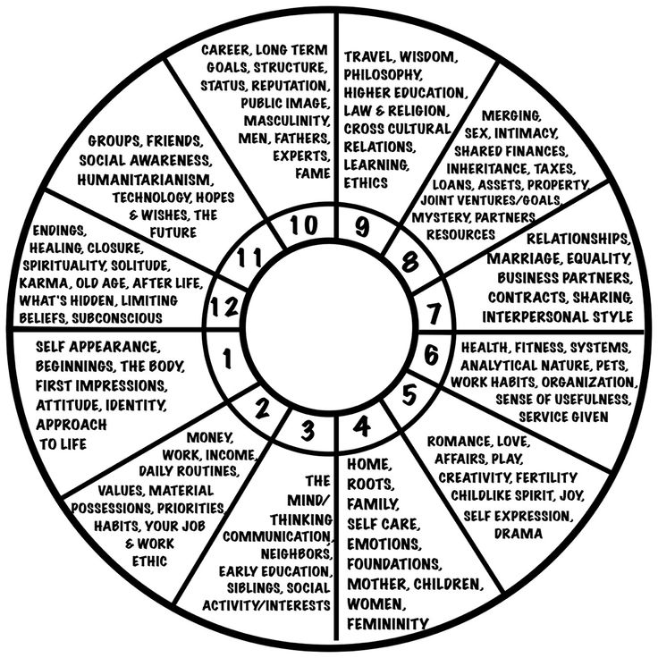
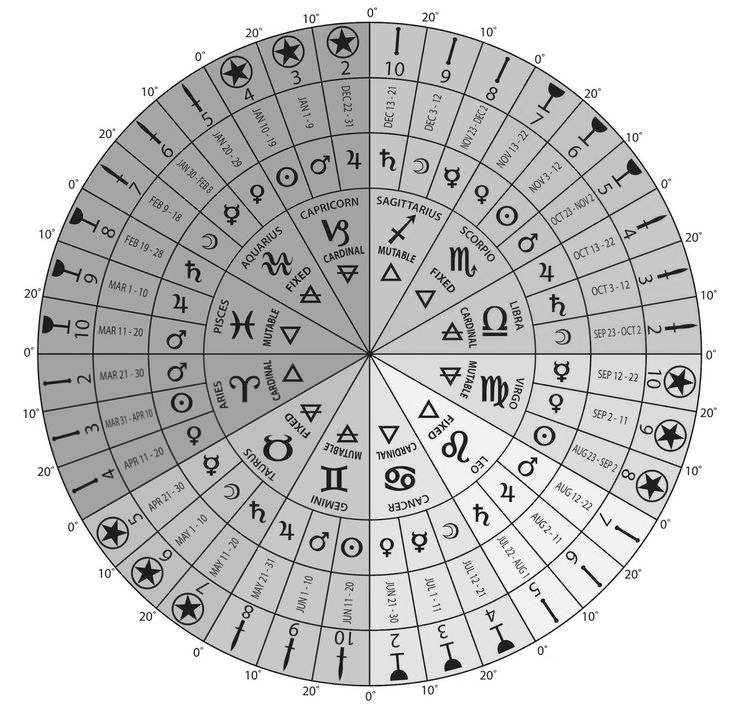

# The Birth Chart

### _<mark style="color:purple;">**The very moment you left your mother's womb, the universe was in a unique state, a combination of every celestial object in a specific position that never existed before and cannot be reproduced again.**</mark>_&#x20;

In this sense, every human is a unique configuration of attributes!&#x20;

Pretty much as when you are playing a videogame, and you need to choose your character's characteristics and properties from a very large set of possibilities.

The moment you were born can be mapped and mathematically represented by an astrological chart, also known as the **birth chart.**

### The 12 sectors in the birth chart wheel

<mark style="color:green;">**Your birth chart represents the coordinates, or exact location, of your birth place: a two-dimensional representation of the Sky projected to Earth at that moment.**</mark>&#x20;

The 12 slices represent the 12 constellations in the Sky (and also the 12 signs of the zodiac). We know that the planets revolve around the Sun, but in astrology, we look at the projection of how the solar system and the main star constellations interplay with us on Earth. From our viewpoint on Earth, the Sun (and other Planets) appears to travel around the Earth, passing through each of the 12 zodiac signs.&#x20;


In Astronomy, the Sun and the Moon are obviously not planets (instead, a star, and a satellite). But in Astrology, we use an adapted language so that we "classify" every celestial object as a "planet".


The birth chart represents our view of the Sky sliced into 12 sections of 30° degrees, with the whole circle measuring 360°. Each of these sections represents **"The 12 Houses":** the 12 areas related to the 12 functions of existing as a human being.&#x20;

<mark style="color:orange;">**In the hero's journey narrative, each of these 12 sectors is one phase in the whole story, flowing counterclockwise and starting from the first house.**</mark>

A fun way to think about a birth chart is: _"You are the God of your story; Planets are the performers; Houses are the chapters of this journey; and the signs are the costumes, the styles, the filters, you run it."_ You can think of Tarot as the street map of your life and birth charts as the satellite view for the larger picture

### The ascendant and the first house of self

The sign of your ascendant is defined by the sign on the horizon when you were born. It's the point where the Earth touches the Sky. That's why you need your exact time and location of birth to define your ascendant!

<mark style="color:blue;">**The ascendant defines not only the sign of your first house (or "The House of Self"), but also the sign of every house in your chart.**</mark>&#x20;

Keep in mind that the angle of your ascendant is important too, and we will discuss it more in the next pages.&#x20;

### The 12 signs and the hero's journey narrative&#x20;

There is a symmetry between the house number and the narrative of each of the 12 zodiac signs. In the case of the first house, the house of self is represented by the ideals of Aries (so it is also called the **"House of Aries"**). These are how the houses are ruled:

| House number | Ruler       |                                      |
| ------------ | ----------- | ------------------------------------ |
| 1st house    | Aries       | House of Self                        |
| 2nd house    | Taurus      | House of Possessions                 |
| 3rd house    | Gemini      | House of Communication               |
| 4th house    | Cancer      | House of Home and Roots              |
| 5th house    | Leo         | House of Pleasure and Creation       |
| 6th house    | Virgo       | House of Service and Health          |
| 7th house    | Libra       | House of Relationships               |
| 8th house    | Scorpio     | House of Sex and Death               |
| 9th house    | Sagittarius | House of Philosophy and Spirituality |
| 10th house   | Capricorn   | House of Ambition and Legacy         |
| 11th house   | Aquarius    | House of Friendship and Hopes        |
| 12th house   | Pisces      | House of Secrets and Isolation       |

We discuss each house in detail in the next section, but here is a high-level summary of how this works:

<mark style="color:orange;">**Another interesting connection to other tools that describe the hero's journey narrative: the birth chart can be divided into the stages represented by Tarot cards:**</mark>

<mark style="background-color:red;">**Pretty cool, right? So let's learn more about the 12 houses! ⤵️**</mark>

