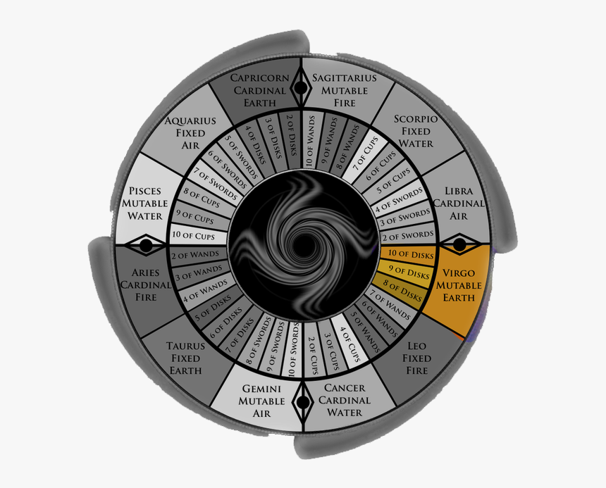

# House VI: Health

The sixth house, ruled by Virgo, determines how you organize your routine, how you take care of your health, and your attitude towards service to others.

### Topics of this house

* Routine tasks and duties
* Skills or training acquired
* Employment and co-workers
* Service performed for others
* Strength and vitality
* Pets and small animals
* Wellness, self-care, and healthcare

