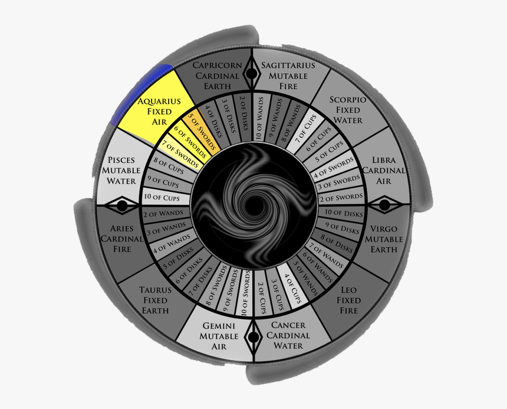

# House XI: Blessings

The eleventh house, ruled by Aquarius, governs networking, social justice, and community. It's known as the "house of good spirit" and tells you how we want to change the world

### Topics of this house

* Good karma, wishes being fulfilled
* Wealth, charity
* Revolutionary ideas
* Technology and innovation
* Connectedness, network
* Groups, communities, friends and acquaintances, followers

