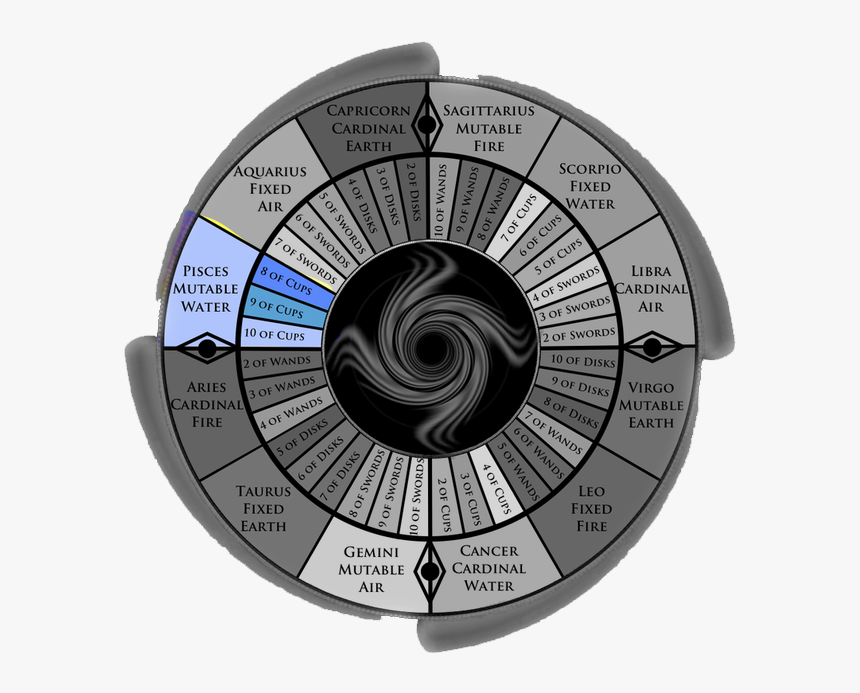

# House XII: Undoing

The twelfth house, ruled by Pisces, is the last and most enigmatic house. This house is connected with the "unseen realm" and it is linked to isolation, self-working, undoing, karma, invisible enemies, and transcendence.

### Topics of this house

* Isolation, privacy, seclusion
* Dreams, secrets, emotions, subconscious
* Intuition, psychic things
* Abundance, additions
* Luck, miracles
* Healing, cleansing, forgiveness
* Finality, completion, conclusion, surrender

