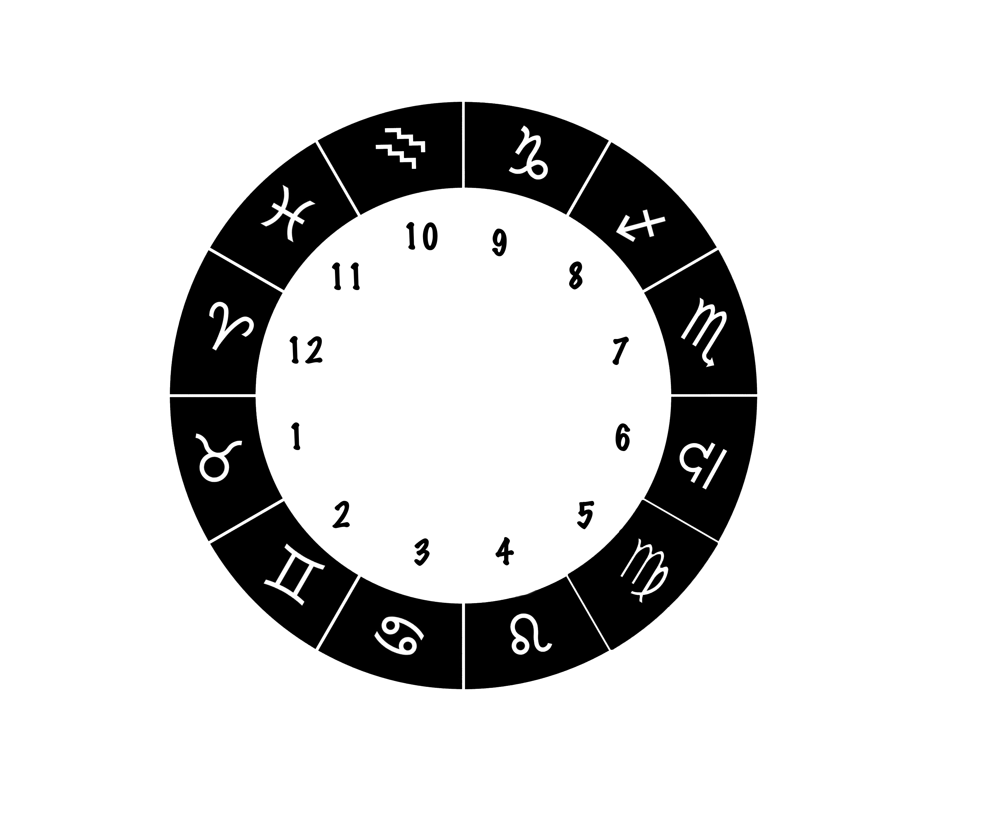

# ♉ Taurus

| Transit                                     | Date  | House                          |
| ------------------------------------------- | ----- | ------------------------------ |
| Mars in Aries 🔲 Pluto in Capricorn         | 07/01 | Mars in 12nd, Pluto in 9th     |
| Mars enters Taurus                          | 07/05 | 1st                            |
| Mercury enters Cancer                       | 07/05 | 5th                            |
| Venus in Gemini 🔺 Saturn in Aquarius       | 07/11 | Venus in 2nd, Aquarius in 10th |
| Venus in Gemini 🔲 Neptune in Pisces        | 07/13 | Venus in 2nd, Neptune in 11th  |
|  🌕 in Capricorn                            | 07/13 | 9th                            |
| Sun 🖤 Mercury in Cancer                    | 07/16 | 3rd                            |
| Venus enters Cancer                         | 07/18 | 3rd                            |
| Mercury enters Leo                          | 07/19 | 4th                            |
| Sun/Mercury in Cancer 💣 Pluto in Capricorn | 07/19 | Cancer in 3rd, Pluto in 9th    |
| Sun in Leo                                  | 07/23 | 4th                            |
| Venus in Cancer 🔲 Jupiter in Aries         | 07/24 | Venus in 4th, Jupiter in 12th  |
| Mercury in Cancer 🔲 Mars in Taurus         | 07/26 | Mercury in 3rd, Mars in 12th   |
| 🌑 in Leo                                   | 07/28 | 4th                            |
| Jupiter retrograde in Aries                 | 07/29 | 12th                           |
| Mercury in Leo 💣 Saturn in Aquarius        | 07/31 | Mercury in 4th, Saturn in 10th |
| Mars 🖤 Uranus and North Node in Taurus     | 07/31 | 1st                            |

